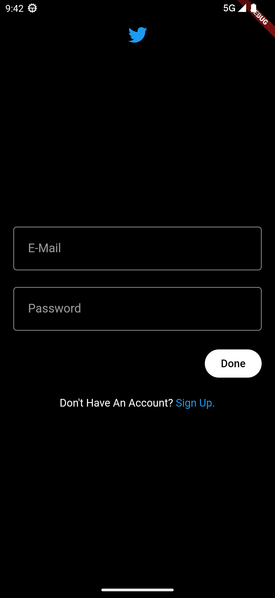
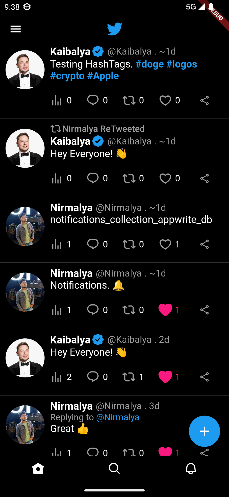
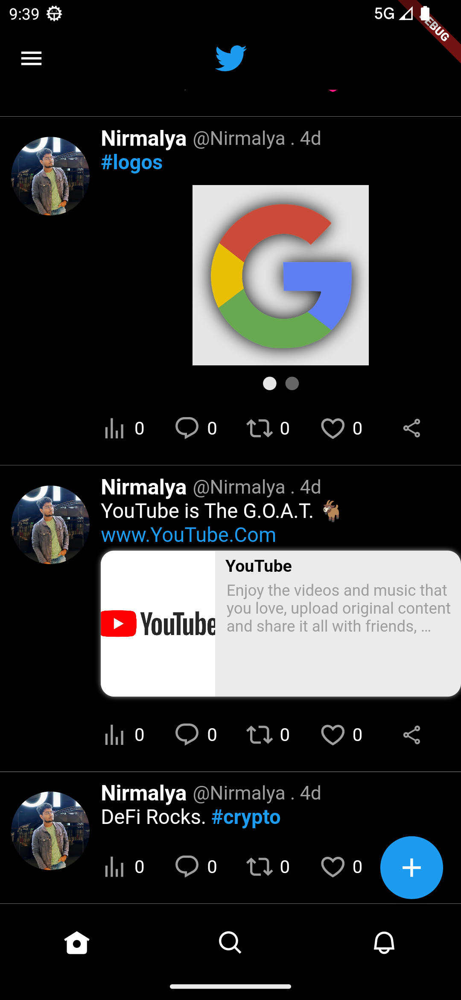
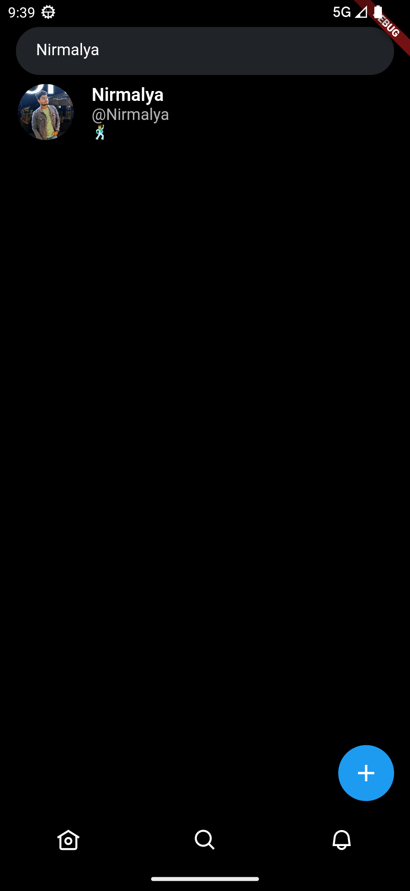
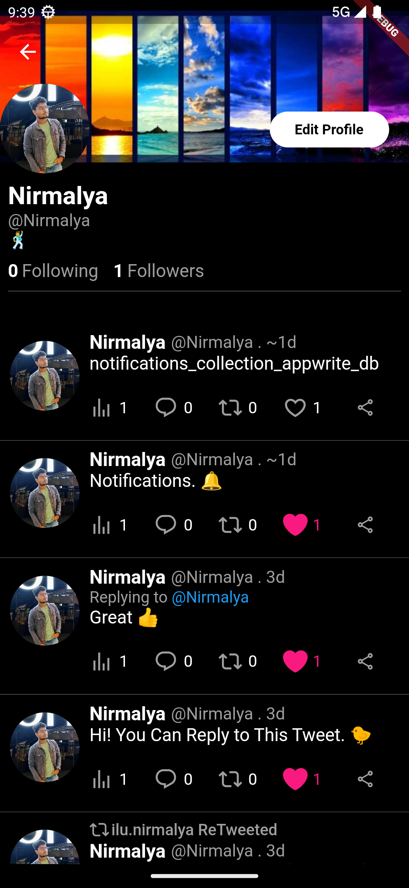
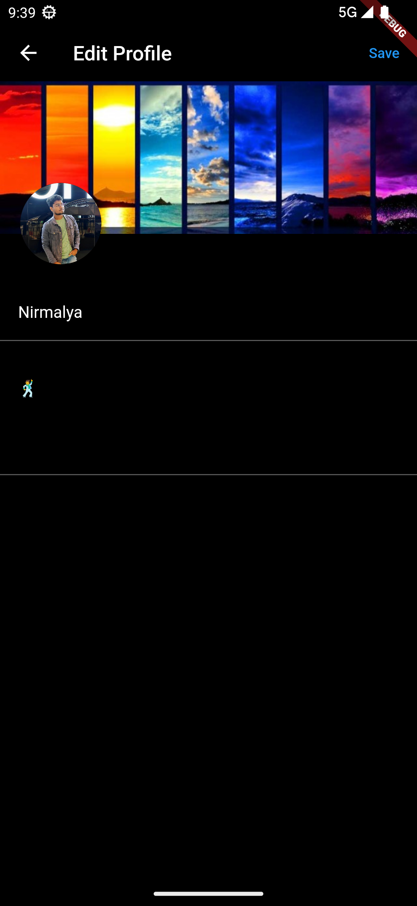
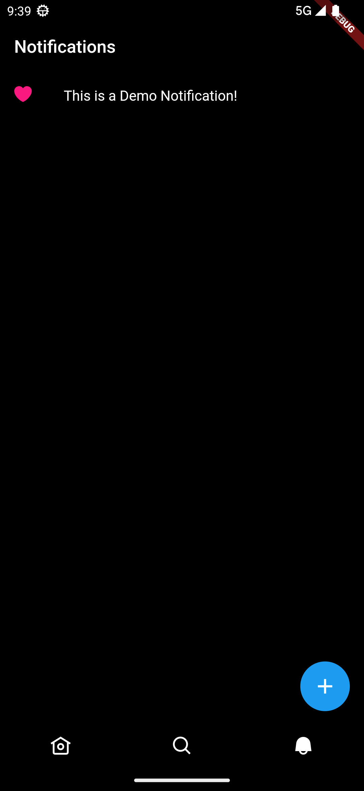
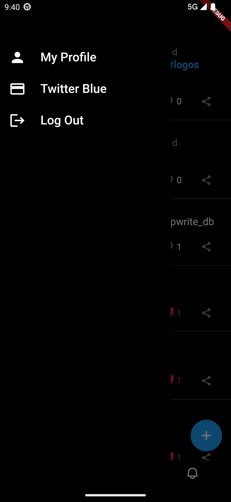

# Twitter Clone (Flutter)

This is a repository for TWITTER Clone with Flutter, Dart, AppWrite, Docker.

Funcionalities:

- Authentication via E-Mail & Password
- AppWrite Backend Server
- Notification system
- Image Upload
- Responsive Layout
- 1 To Many Relations (User - Post)
- Many To Many Relations (Post - Comment)
- Following functionality
- Comments / Replies
- Search by HashTags
- View Link Preview inside Posts
- Search User
- RealTime Updates
- DataBase Queries
- Editing Profile Details including Profile/Banner Picture
- Twitter Blue Verification Tag

### Prerequisites

**Flutter SDV ^= 3.7.9**

**Docker (for AppWrite)**

**Android Studio / XCode (Virtual Device Simulation)**

**VS Code (IDE)**

### Cloning the repository

```shell
git clone https://github.com/nayak-nirmalya/twitter_clone_flutter.git
```

## Running Project

Install Docker for AppWrite to Work.

To Install AppWrite via Docker Run:

```shell
docker run -it --rm `
    --volume /var/run/docker.sock:/var/run/docker.sock `
    --volume ${pwd}/appwrite:/usr/src/code/appwrite:rw `
    --entrypoint="install" `
    appwrite/appwrite:1.2.1
```

After Installation Initiate DataBases from Model and add Attributes and Indexes, also configure databaseId, projectId, collections Ids and for Android Emulator to work properly assign your IPv4 Address to localhost.

Then inside root folder run:

```shell
flutter run
```

Select your Device to Run App.

If You Face any Issues while building app. Try running:

```shell
cd android

./gradlew clean
./gradlew build

cd ..
flutter clean
flutter doctor
flutter run
```

## Screenshots

<div align='center'>

### Log In / Sign Up Page



### Tweet Feed



### Tweet Feed with Images & Link Preview



### Reply / Comment Page


### Search Tweet by HashTags


### Search User



### User Profile Page



### Edit Profile Page



### Notification Tab



### Side Drawer



</div>
